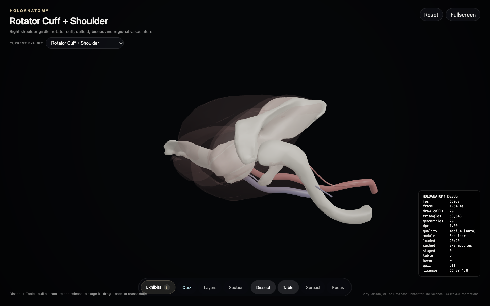
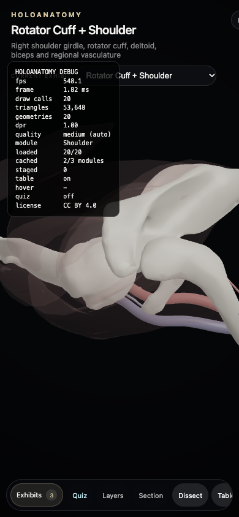

# HoloAnatomy Shoulder 2.0 — frozen audit

Recorded 2026-09-30 before redesign. Base commit: a9f0b9167527ffc221e17285d65c3787509f2b2e. Dedicated branch: holoanatomy-shoulder-2-20260930. Isolated worktree includes the current working changes; the original checkout remains untouched. Full status and binary diff are preserved in shoulder-baseline. Existing local changes include portfolio copy and a shoulderStudio module; deployed production still exposes the earlier Quiz/Exhibits toolbar.

## Current production inspection

Inspected https://arjansinghpuniani.com/holoanatomy/index.html in Chromium at 1440×900 and 390×844. Screenshots and serialized renderer state are in shoulder-baseline. Twenty meshes load, 53,648 triangles, no browser exceptions. Source OBJ payload: 3,749,763 bytes. Texture memory: zero (no textures). Debug reports ~650 fps; this is NOT a credible presented-frame measurement and must not be reused as a performance claim.

The default screenshot is dominated by white bone and faint ghosted muscle. The cuff is not the subject. BodyParts3D coordinates have longitudinal extent in Z (humerus Z=1029–1337), but the renderer uses Y-up without an anatomical coordinate transform. Thus existing yaw/pitch views are not dependable anatomical presets. Baseline filenames posterior/anterior/superior record the original renderer's canonical axis settings, not validated anatomical directions. A corrected anatomical axis convention is a required reconstruction task.

Normalization uses all twenty meshes including the full humerus and regional vessels. Default target is the union bounding-box center. Every muscle starts ghosted. Dissect and Table start enabled. No cuff-specific default composition exists in production.

## Baseline checks

Baseline test command initially encountered dependency-cache sandbox permissions; unrestricted retry encountered Vitest fork startup timeouts (7 unhandled worker errors). Typecheck was invoked; final result is recorded in typecheck.log. Initial copied-worktree build failed because an existing untracked homepage CSS file had not yet been copied; after copying it unchanged the baseline build is being re-run. These are recorded as failures/pending, not successful baseline tests. Logs will be finalized before release.

## Interaction audit

Based on production screenshots, loaded source, and camera state. Physical trackpad/iPhone testing is not available in this session; synthetic browser gestures will be distinguished from hardware validation.

| Interaction | Existing implementation / consequence |
|---|---|
| Left drag | In default Dissect mode, pointer-down on a mesh immediately selects and begins pulling; only empty-space drag orbits. Camera and selection compete. |
| Trackpad | Every wheel event becomes zoom; horizontal delta ignored. No intentional two-finger orbit/pan convention. |
| Pinch | Touch distance ratio drives zoom; desktop ctrl-wheel is not distinguished. |
| Pan | No pan handler. |
| Picking | GPU ID pass; pointer-down picks for dissection. Movement threshold resets per pointer-down, introducing multi-touch ambiguity. |
| Isolate | Production ghosts context. Local overrides short-circuit isolation, so the modified local studio can ignore isolate. |
| Reset | Generic camera target/distance, not shoulder composition; reassembles pieces. |
| Focus | Double click targets mesh bounds with hard clamp; F shortcut absent. |
| Mobile | Two touches pinch; no two-finger midpoint pan. Dense scrolling toolbar, small targets, default pull behavior. |

## Asset inventory

All twenty structures are BodyParts3D / ISA Release 4.0, CC BY 4.0. Attribution: BodyParts3D, © The Database Center for Life Science licensed under CC Attribution 4.0 International. Source license verified against https://dbarchive.biosciencedbc.jp/en/bodyparts3d/lic.html on audit date. No textures, UVs, tangents, or source material slots are present. All have OBJ normal records. Each current module is shoulder. Broad classifications match the names; no muscle is classified as a separately sourced tendon. This is an engineering consistency check, not independent clinical validation. Full per-structure fields including source, license, material records, bytes and bounds are in mesh-inventory.json.

| ID | Anatomy | Vertices | Faces | UV / normals / tangents | Layer | Raw bounds (source units) |
|---|---|---:|---:|---|---|---|
| FJ3384 | Right scapula | 13118 | 26172 | no / yes / no | skeleton | [-166.464,-102.856,1183.96] → [-57.0538,5.08275,1349.86] |
| FJ3362 | Right clavicle | 583 | 1146 | no / yes / no | skeleton | [-145.277,-146.948,1308.62] → [-9.66165,-54.4125,1355.44] |
| FJ3368 | Right humerus | 2233 | 3784 | no / yes / no | skeleton | [-240.841,-100.219,1029.2] → [-140.09,-51.0391,1336.54] |
| FJ1506 | Right supraspinatus | 843 | 878 | no / yes / no | muscles | [-188.443,-91.9013,1307.34] → [-63.876,-12.9613,1342.36] |
| FJ1500 | Right infraspinatus muscle | 743 | 866 | no / yes / no | muscles | [-189.05,-77.087,1206.53] → [-60.2584,3.66613,1330.97] |
| FJ1504 | Right subscapularis | 2775 | 2092 | no / yes / no | muscles | [-166.117,-99.9547,1195.16] → [-63.1822,-2.75783,1324.8] |
| FJ1508 | Right teres minor | 392 | 506 | no / yes / no | muscles | [-190.554,-80.3106,1220.56] → [-105.409,-12.4062,1316.92] |
| FJ1467 | Acromial part of right deltoid | 916 | 1300 | no / yes / no | muscles | [-227.228,-103.338,1205.09] → [-146.586,-40.8371,1349.22] |
| FJ1468 | Clavicular part of right deltoid | 2592 | 2206 | no / yes / no | muscles | [-203.619,-121.331,1203.85] → [-88.555,-75.1252,1355.39] |
| FJ1513 | Spinal part of right deltoid | 1665 | 1900 | no / yes / no | muscles | [-219.171,-79.253,1187.75] → [-82.8341,-2.72512,1339.84] |
| FJ1478 | Long head of right biceps brachii | 1053 | 1426 | no / yes / no | muscles | [-229.86,-109.292,994.072] → [-135.268,-67.8089,1339.42] |
| FJ3579 | Right subclavian artery | 247 | 452 | no / yes / no | arteries | [-82.176,-112.221,1330.94] → [-9.74729,-94.3546,1353.03] |
| FJ2268 | Right axillary artery | 915 | 1826 | no / yes / no | arteries | [-151.44,-106.425,1258.12] → [-76.9415,-80.0562,1339.84] |
| FJ2303 | Right suprascapular artery | 1027 | 1912 | no / yes / no | arteries | [-138.112,-102.305,1291.49] → [-41.0367,-36.8373,1354.82] |
| FJ2298 | Right subscapular artery | 431 | 786 | no / yes / no | arteries | [-141.982,-92.2239,1279.4] → [-128.94,-83.6516,1294.89] |
| FJ2273 | Right circumflex scapular artery | 399 | 778 | no / yes / no | arteries | [-144.23,-86.7127,1280.56] → [-134.135,-51.1158,1293.92] |
| FJ2269 | Right axillary vein | 1112 | 2146 | no / yes / no | veins | [-157.167,-115.169,1232.85] → [-74.9191,-91.3942,1335.14] |
| FJ2302 | Right suprascapular vein | 1003 | 1986 | no / yes / no | veins | [-139.65,-113.877,1283.13] → [-63.5169,-51.6802,1343.96] |
| FJ2299 | Right subscapular vein | 265 | 526 | no / yes / no | veins | [-129.826,-106.668,1292.19] → [-126.277,-100.419,1312.31] |
| FJ2274 | Right circumflex scapular vein | 505 | 960 | no / yes / no | veins | [-151.855,-103.087,1282.79] → [-127.859,-52.2161,1295.4] |

## Asset ceiling and engineering decisions

| Limitation | Category | Evidence | Decision |
|---|---|---|---|
| Cuff surface detail | A geometry | SITS: 878 / 866 / 506 / 2092 triangles | Preserve landmarks; no subdivision pretending to recover anatomy. Document asset gap. |
| Tendons, insertion footprints, capsule, labrum, cartilage, bursae, shoulder nerves | F missing anatomy | No separately labelled geometry in shoulder manifest | Text curriculum only; no invented overlays or footprints. |
| Full humerus and empty canvas | D composition | Union bounds plus wrong up axis | Cuff-based target, correct rigid axis transform, explicit camera crop. |
| Shiny pale bone / uniform soft tissue | B material, C lighting | One simple Blinn-like shader and rim term | Data-driven rough tissue materials, linear workflow, restrained studio lighting. |
| Detached vessel appearance | A geometry, H UI | Incomplete regional tree shown without qualification | Secondary regional view; disclose incomplete coverage, never add connecting tubes. |
| Pulling competes with orbit | E interaction | Default dissect=true | Explore default; click/drag threshold; deliberate Peel staging. |
| No GLB/texture path | G renderer | Position/normal/index-only pipeline | Isolated shoulder renderer with glTF support, OBJ fallback, PBR maps. |
| Toolbar complexity | H UI | Eight primary actions + exhibit picker | Four modes; secondary information/tools. |
| Misleading performance | G renderer | ~650 fps debug value | Measure rAF intervals, GPU draw calls, payload and device tier independently. |

## Baseline evidence

Audit gate satisfied for reconstruction: actual production inspected and captured; source inventory measured; failures and hardware limitations explicitly recorded. No claim of clinical validation or successful release.

## Baseline finalization

The complete copied working tree passes `npm run typecheck` and `npm run build`. The original default fork-based test runner timed out; the same suite passes with `npm test -- --pool=threads --maxWorkers=2`: 87 tests. The worker-pool workaround changes execution concurrency, not assertions. Official source tables were downloaded read-only and all 20 FMA-to-mesh mappings were checked (see official-verification.json); SHA-256 hashes were recorded.
